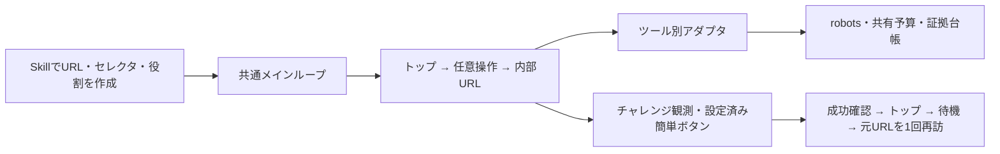

# Bot検知とブロッキング検証パイプライン

Rebrowser Bot DetectorとFingerprintJS BotD 2.0.0の項目別診断、指定4サイトの初回応答、サイト内リンク、セレクタ操作、簡単なチャレンジ、操作速度・拡張機能の比較を共通インターフェイスで実行する任意のNode.js実験。Googleは最後の任意段階。既存の発見型クロールとは独立している。

## 共通インターフェイス

`sites.json`にhome、targets、params、selectors、操作手順と成功条件を注入する。サイトごとにクロールの実行器を書き直す必要はない。

| モジュール | 担当 |
|---|---|
| `framework.mjs` | 比較条件のメインループ、セッション、再開と結果保存 |
| `manifest.mjs` | URL展開、対象範囲、操作・拡張・比較条件の検査 |
| `scenario.mjs` | 注入された役割、トップ→内部URL、回復と再訪の段階 |
| `adapters.mjs` | 各ツールのnative fetch/goto/入力とCookie継続 |
| `runner.mjs` | robotsと同一originを検査して実際の通信を実行 |
| `evidence.mjs` | 共有予算、失敗の計上、原body・DOM・台帳の保存とverify |
| `observations.mjs` | 文字コードと観測した応答の分類 |
| `runtime.mjs` | 共通の上限・UA・依存と一時データの配置・ソース証拠 |
| `runner-cli.mjs` | 初回応答・検知器の旧CLIの実装 |

`runner.mjs`と`framework.mjs`の既存CLI・公開メソッドは引き続き使える。新しいrunは分割後の全実装を自動でハッシュ保存する。過去の台帳と設定は同じverifyで照合できる。`runner.mjs verify`は破損した証拠を検出すると非ゼロで終了する。



各方式×サイト×比較条件内でCookieとブラウザセッションを維持する。比較条件ごとにセッションを新しくするが、方式×サイトの取得予算とチャレンジ試行上限は全条件で共有する。

| 機能 | wreq-js / impit | Patchright / Playwright対照 | rebrowser-patches + Lightpanda |
|---|---|---|---|
| リンクアクセス | native fetch | native page.goto | native Puppeteer page.goto |
| Cookie継続 | 対応 | 対応 | 対応 |
| fill / click / hover・前後確認 | 未対応として記録 | 対応 | 今回のfixtureで対応確認 |
| 操作速度・ポインタ移動の比較 | 未対応として記録 | 対応 | 今回のfixtureで対応確認 |
| Chromium拡張機能 | 未対応として記録 | 専用persistent contextで対応 | 未対応として記録 |

操作は入力値、DOMの変化、遷移先などの成功条件を確認する。APIが成功を返しても、元から条件を満たしていたクリックや変化を確認できない操作は成功扱いしない。fillは一意に一致したtext/search inputまたはtextareaだけに実行する。

## 導入

Node.js 22以上、Python 3.12以上、Chromium、環境のHTTPS_PROXYとCA信頼が必要。

```bash
python3 -B experiments/bot-diagnostics/setup.py
python3 -B -m unittest discover -s tests -p 'test_lab*.py'
```

npm依存はpackage-lock.jsonを使用し、.deps/bot-diagnosticsへ配置する。Rebrowserソースはコミット固定。Lightpandaはversions.jsonのSHA256と一致するビルドだけを使う。nightlyの配布が更新されていた場合は停止する。検証済みバイナリを.deps/bot-diagnostics/lightpandaへ別途配置するか、新しいバージョンの別実験として計画する。

ブラウザ用CAを環境が配布している必要がある。ERR_CERT_AUTHORITY_INVALIDはサイト側のブロックとして扱わない。TLS検証を無効化して続行する設定は実装していない。恒久的なユーザー/システムのCA追加をsetupから行わない。

管理Chromiumが拡張追加を禁止する環境では`environment_policy_blocked`を記録する。専用Chrome for Testingをリポジトリ内へ導入するには次を使う。比較時は全Chromium条件を同じ実行ファイルにそろえる。

```bash
python3 -B experiments/bot-diagnostics/setup.py --with-browser
export BOT_DIAGNOSTICS_CHROMIUM=/workspace/Searching_Experiment/.deps/bot-diagnostics/browsers/chromium-1243/chrome-linux64/chrome
```

実際の配置先はsetup出力または`.deps/bot-diagnostics/browser-runtime.json`を使う。Linux x86_64で検証済み。今回の初回実サイト測定は管理Chromium151、拡張機能のfixture検証は専用Chrome153であり、同条件の実サイト比較に合算しない。

## Dockerで実行する

標準のPythonイメージと別に`bot-diagnostics`プロファイルを用意した。Node 22、固定npm依存、Chrome for Testing、Rebrowserソース、SHA256固定Lightpandaを含む。Linux x86_64で検証済み。依存は`/opt/bot-diagnostics`、一時プロファイルは`/tmp/bot-diagnostics-state`、結果は`/data`に分け、UID 10001と読み取り専用root filesystemで動作する。

```bash
docker compose --profile bot-diagnostics build bot-diagnostics
docker compose --profile bot-diagnostics run --rm bot-diagnostics plan --all-options
docker compose --profile bot-diagnostics run --rm bot-diagnostics smoke /data/new-session-fixture
docker compose --profile bot-diagnostics run --rm bot-diagnostics options-smoke /data/new-options-fixture
```

実サイトのシナリオは`run /data/your-new-run --all-options`、照合は`verify /data/your-new-run`。実サイト取得には従来と同じHTTPS_PROXYとCA信頼が必要で、自動でプロキシを外す経路はない。ローカルfixtureはプロキシなし・外部ネットワークなしでも検証できる。Composeの通常の`lab`はPythonのみのまま。

Cloud環境ではDockerに配布済みのプロキシ設定を保持し、公開CAだけをBuildKit secretと実行時の読み取り専用mountで渡す。セッションCAをイメージへ焼き込まず、Chrome用CAはコンテナ内の一時NSSストアに追加する。

```bash
mkdir -p .lab-output/lightpanda-build
cp .deps/bot-diagnostics/lightpanda .lab-output/lightpanda-build/lightpanda
docker compose -f compose.yaml -f compose.bot-diagnostics-cloud.yaml --profile bot-diagnostics build bot-diagnostics
docker compose -f compose.yaml -f compose.bot-diagnostics-cloud.yaml --profile bot-diagnostics run --rm bot-diagnostics plan --all-options
```

`CODEX_PROXY_CERT`は環境が配布する公開CA、`SSL_CERT_FILE`はそのCAを含むbundleを指定する。既存Dockerの設定ファイルや資格情報を作り直さない。Buildxのキャッシュ先が読み取り専用の環境では`BUILDX_CONFIG=$PWD/.lab-output/buildx`を上のbuildコマンドだけに付ける。

`BOT_DIAGNOSTICS_LIGHTPANDA_CONTEXT`で検証済みバイナリを置くフォルダを指定できる。中の`lightpanda`をSHA256照合して使う。未配置なら空のフォルダを作り、固定配布URLから導入する。nightly更新でハッシュが変わっていた場合は停止する。ホストから導入する場合にも`setup.py --lightpanda-file PATH --with-browser`を使える。

保存した実行結果をZIPにしてホストへ取り出す例:

```bash
docker compose --profile bot-diagnostics run --name bot-diagnostics-export bot-diagnostics export --run /data/your-new-run --output /data/your-checkpoint.zip
docker cp bot-diagnostics-export:/data/your-checkpoint.zip .lab-output/your-checkpoint.zip
docker rm bot-diagnostics-export
```

名前付きexportコンテナを取り出しまで残す。`/data`のrunはZIP内で`external-runs/`に配置し、CHECKPOINT.jsonに対応を保存する。既存ZIP・runは上書きしない。独自サイト設定や役割モジュールは読み取り専用でmountし、`--sites=FILE` / `--roles=FILE`で注入する。

## 共通パイプラインを実行する

```bash
node experiments/bot-diagnostics/framework.mjs plan --all-options
node experiments/bot-diagnostics/framework.mjs run lab-runs/your-new-run --all-options
node experiments/bot-diagnostics/framework.mjs verify lab-runs/your-new-run
```

`plan`は通信を発生させず設定を展開する。オプションなしでは4サイトのトップ→内部URL。`--all-options`は以下をすべて選択する。

Rebrowser/BotDの項目別診断を新しく取得する場合は、先に`runner.mjs detectors lab-runs/your-detector-run`を実行する。検知器はローカルの独立した対照実験で、実サイトのWAF原因と直接対応づけない。

| フラグ | 実行内容 |
|---|---|
| `--selectors` | トップ本文を観測した後にサイト別最大3操作と成功条件を検査 |
| `--recover-simple` | 設定された簡単なボタンだけ操作し、通常本文を確認後、トップ・待機・元URLへ1回再訪 |
| `--humanlike` | 標準条件に加え、seed固定の待機・ネイティブポインタ移動・1文字ごとの入力条件を比較 |
| `--extensions` | 標準条件に加え、同梱の通信なし観測用MV3拡張を読み込み、DOMマーカーで読み込みを確認 |
| `--extension=DIR` | 小さいcontent-scriptのみのローカルMV3拡張を追加した条件。成功確認用probeは設定へ注入 |
| `--include-google` | Googleトップ・検索URLを最後に評価。robots拒否は停止として記録 |
| `--sites=FILE` / `--roles=FILE` | サイト設定 / 小さい役割モジュールを差し替える |
| `--resume` | 同じ設定・台帳・残予算で再開。完了済み条件は再取得しない |

各方式×サイトで25リクエスト・保存/計上body8MiBを共有する。robots・リダイレクト・失敗・操作に伴うGETも計上する。全条件を選択すると予算内で後の条件が停止する場合がある。条件を増やして予算をリセットする動作はない。Chromiumの実転送量のハード上限ではない。

サイト本文・リソースは同一originのGETに限定し、画像・favicon・メディア・フォント・WebSocketを止める。外部iframe型CAPTCHA・画像パズル・バックグラウンド通信を要する拡張はこの実行境界で未対応。拡張はpermitted content-scriptのみ、32ファイル・各256KiB以内。観測用拡張や操作速度の変更が検知耐性を改善するとは仮定しない。

実サイトで簡単なボタン突破はまだ確認できていないため、各サイトの`recovery`はnull。IndeedのReturn homeを突破ボタンとして使わない。Google検索はrobotsで拒否され得る。主な候補と未検証箇所は`sites.json`、保存HTML・画面は[証拠一覧](../../docs/bot-diagnostics-evidence.md)を参照。

途中終了からの再開は同じフラグ・設定で行う。未確定要求の予約bytesを保持し、Cookieを含むセッションは新しく開始する。実装の修復前後のソースハッシュをinvocationsへ追記する。

```bash
node experiments/bot-diagnostics/framework.mjs run lab-runs/your-new-run --all-options --resume
```

## Skillでサイトの役割を追加する

`pipeline-results.json`の`state`はリンク移動の終了状態。任意操作の成否は`events[].result.outcome`と前後のDOM確認で判断する。`navigation_completed`だけでは任意操作の成功を意味しない。

[bot-blocking-scenarios Skill](../../.agents/skills/bot-blocking-scenarios/SKILL.md)が手順。基本は設定だけで済む。分岐が必要な場合だけ次のようなモジュールを作る。

```js
export const roles = {
  async homepage({adapter, links}) { return adapter.homepage(links.home); },
  async target({adapter, url, selectors, params}) {
    return adapter.followLink(url);
  },
};
```

`adapter.fetch/goto`へ未対応メソッドを指定した場合は`unsupported_capability`。役割から裸のHTTPやブラウザAPIを呼んで取得境界を迂回しない。セレクタ・回復・拡張用の役割も差し替え可能で、操作には共通adapterのメソッドを使う。

## 外部サイトにアクセスせず検証する

```bash
node experiments/bot-diagnostics/smoke.mjs .lab-output/new-session-fixture
node experiments/bot-diagnostics/options-smoke.mjs .lab-output/new-options-fixture
```

前者は全5方式のCookie継続・内部URL・302/200の計上、後者はネイティブ操作、操作速度、簡単なチャレンジ、1回の再訪、拡張の実読み込み、未対応機能、完了後の再開を実ブラウザとローカルfixtureで検証する。実サイトの突破成功を意味しない。新しい出力先を使う。

## チェックポイントを取り出す

コードだけを新環境へ配布する場合は、リポジトリ全体の`python3 -B scripts/package_cloud.py --output .lab-output/your-cloud.zip`を使う。標準Python基盤と診断用のコード・テスト・Docker・Skillを含め、CRCとSHA256を照合する。配置先は公開ソースの許可リストだけから選択する。実行途中の証拠を含める場合は以下のexportを使う。

```bash
python3 -B experiments/bot-diagnostics/export.py --run lab-runs/your-new-run --output .lab-output/your-checkpoint.zip
```

verifyを通した台帳・設定・原HTML・DOM・画面と、共通コード・Skill・ドキュメントをZIPへ保存し、全ファイルのSHA256を再照合する。`--include-measured`で今回の固定実測とfixtureの履歴も含められる。依存バイナリ、ブラウザのCookieストア、資格情報は含めない。既存ZIPを上書きしない。

## 検知器・今回と同じ初回応答の実行

```bash
node experiments/bot-diagnostics/runner.mjs all lab-runs/bot-diagnostics-new
node experiments/bot-diagnostics/runner.mjs verify lab-runs/bot-diagnostics-new
```

既存runを上書きしない。detectorsまたはsitesをallの代わりに指定して対象を分けられる。依存の場所はBOT_DIAGNOSTICS_DEPS、Chromiumの実行ファイルはBOT_DIAGNOSTICS_CHROMIUM、一時プロファイルの書き込み先はBOT_DIAGNOSTICS_STATEで指定できる。

失敗を修復して同じ台帳・残予算内で再試行する場合はresume-sitesを使う。過去の失敗、確保済みbytes、robots取得も保持する。方式とサイトの選択は既存configの要素に限定する。

```bash
BOT_DIAGNOSTICS_CLIENTS=patchright BOT_DIAGNOSTICS_TARGETS=joshin \
  node experiments/bot-diagnostics/runner.mjs resume-sites lab-runs/bot-diagnostics-new
```

runの横に.lockを作り、同じrunの二重実行を止める。実行中のプロセスを強制終了した場合、PIDを確認してからロックを処理する。未確定リクエストは上限いっぱいのbytesを計上したまま扱い、予算を返却しない。

ブラウザは各HTTPリクエストとリダイレクトを捕捉し、robots、同一origin、GET、回数・保存body上限を検査する。ChromiumはCDP、LightpandaはPuppeteerのrequest interceptionを使う。公開デモには接続せず、外部originの検知器依存も実行しない。

## 今回の結果の再集計

```bash
node experiments/bot-diagnostics/summarize.mjs
```

このコマンドは今回の固定runパスからsummaryとdocsのレポートを再生成し、原履歴は保持する。一般の新しいrunを自動選択するコマンドではない。

raw HTML、DOM、スクリーンショット、BotDのgetComponents/getDetections、Rebrowserの原rating、設定、台帳、環境とソースハッシュを保持する。HTTPクライアントのHTML取得をJS検知器の合格に換算しない。検知器の判定から実サイトのWAF原因を断定しない。
