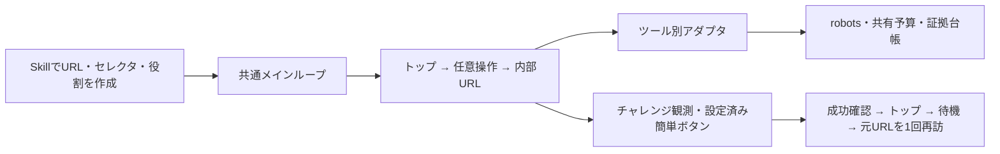

# Bot検知とブロッキング検証パイプライン

Rebrowser Bot DetectorとFingerprintJS BotD 2.0.0の項目別診断、指定4サイトの初回応答、サイト内リンク、セレクタ操作、簡単なチャレンジ、操作速度・拡張機能の比較を共通インターフェイスで実行する任意のNode.js実験。Googleは最後の任意段階。既存の発見型クロールとは独立している。

## 共通インターフェイス

`sites.json`にhome、targets、params、selectors、操作手順と成功条件を注入する。サイトごとにクロールの実行器を書き直す必要はない。

| モジュール | 担当 |
|---|---|
| `framework.mjs` | 比較条件のメインループ、セッション、再開と結果保存 |
| `manifest.mjs` | URL展開、対象範囲、操作・拡張・比較条件の検査 |
| `scenario.mjs` | 注入された役割、トップ→内部URL、回復と再訪の段階 |
| `adapters.mjs` | 各ツールのnative fetch/goto/入力とCookie継続 |
| `runner.mjs` | robotsと同一originを検査して実際の通信を実行 |
| `evidence.mjs` | 共有予算、失敗の計上、原body・DOM・台帳の保存とverify |
| `observations.mjs` | 文字コードと観測した応答の分類 |
| `runtime.mjs` | 共通の上限・UA・依存と一時データの配置・ソース証拠 |
| `runner-cli.mjs` | 初回応答・検知器の旧CLIの実装 |

`runner.mjs`と`framework.mjs`の既存CLI・公開メソッドは引き続き使える。新しいrunは分割後の全実装を自動でハッシュ保存する。過去の台帳と設定は同じverifyで照合できる。`runner.mjs verify`は破損した証拠を検出すると非ゼロで終了する。



各方式×サイト×比較条件内でCookieとブラウザセッションを維持する。比較条件ごとにセッションを新しくするが、方式×サイトの取得予算とチャレンジ試行上限は全条件で共有する。

| 機能 | wreq-js / impit | Patchright / Playwright対照 | rebrowser-patches + Lightpanda |
|---|---|---|---|
| リンクアクセス | native fetch | native page.goto | native Puppeteer page.goto |
| Cookie継続 | 対応 | 対応 | 対応 |
| fill / click / hover・前後確認 | 未対応として記録 | 対応 | 今回のfixtureで対応確認 |
| 操作速度・ポインタ移動の比較 | 未対応として記録 | 対応 | 今回のfixtureで対応確認 |
| Chromium拡張機能 | 未対応として記録 | 専用persistent contextで対応 | 未対応として記録 |

操作は入力値、DOMの変化、遷移先などの成功条件を確認する。APIが成功を返しても、元から条件を満たしていたクリックや変化を確認できない操作は成功扱いしない。fillは一意に一致したtext/search inputまたはtextareaだけに実行する。

## 導入

### Chromiumの証明書DBとCloud実行権限

Patchrightの`ERR_CERT_AUTHORITY_INVALID`は、今回のCloudではNSS DBが読み取り専用だったことが原因だった。Chromium 153は既存の`~/.pki/nssdb`を優先し、`NSS_InitReadWrite`に失敗するとDBなしで起動する。`XDG_DATA_HOME`に別DBを作っても、既存のlegacy DBがある場合は使われない。

実行時に既存NSSディレクトリへの書き込みアクセスを与えると、配布済みCAを読み込めた。CAの追加・差し替えやTLS検証無効化は行っていない。Codexのこの環境では、通常のnetworkアクセスに加えて`additional_permissions.file_system.write`へ`/home/agent/.pki/nssdb`を指定する。通常のシェルでは、実行ユーザーがそのDBを読み書きできることが必要。読み取り専用mountは`chmod`では直らない。

外部サイト用のChromium起動前に`chromium-trust.mjs`が参照先と権限を確認し、同じ問題なら`chromium_nss_db_not_writable`で通信前に停止する。`setup.py --with-browser`で入れた専用Chromiumを既定で優先し、`BOT_DIAGNOSTICS_CHROMIUM`での明示指定も維持する。

```bash
node experiments/bot-diagnostics/chromium-trust-smoke.mjs .lab-output/new-chromium-trust-check
```

上記は本番と同じ事前チェックを通した後、ローカルの未信頼証明書を拒否することを確認する。試験用CAは登録しない。修復後のサイト観測は[比較記録](COMPARISON.md#bounded-site-observations)を参照。

### Obscura・Patchrightとの比較

[公式Obscura](https://github.com/h4ckf0r0day/obscura) v0.2.3の通常版・stealth版・no-render版を固定SHA256で導入し、Lightpanda補完版およびPatchrightと比較できる。

```bash
python3 -B experiments/bot-diagnostics/setup.py --lightpanda-release 1.0.0 --with-browser
python3 -B experiments/bot-diagnostics/setup-obscura.py
export BOT_DIAGNOSTICS_CHROMIUM="$PWD/.deps/bot-diagnostics/chromium"
node experiments/bot-diagnostics/engine-core-benchmark.mjs .lab-output/new-engine-core --iterations=5 --pages=8
node experiments/bot-diagnostics/engine-comparison.mjs .lab-output/new-engine-pool --iterations=5 --pages=8 --tools=rebrowser-lightpanda,patchright
```

両ベンチマークは制御したloopback fixture限定。`engine-core-benchmark`はPoolなしの共通Cookieセッションで、取得＋同じDOM抽出を測る。fixture側が全要求の本文をEvidenceへ保存する。プロセスツリー全体のRSS合計とPSS（共有ページの重複を按分）を記録する。`engine-comparison`はPoolありの実際のToolAdapter経路で、robots、100ms観測、証拠保存を含む。各方式を別Node workerで起動し、実行順を交代する。別の測定同士の数値は直接比較しない。

公式Obscura 3種類の`openBrowser()`はローカル検出器・エンジン測定用。v0.2.3では独立CDPセッションのFetchイベントを受け取れず、Playwright routeもredirect先の要求を捕捉できなかったため、`ToolAdapter`/`browserSite`では通信前に`unsupported_capability:budgeted_navigation`で停止する。UAのcontext overrideも反映されないので、runtimeには実測したUAを記録する。通常版とno-render版は標準モード、stealth版は`--stealth`を有効にする。

別の方式名`obscura-patched`は、同じv0.2.3ソースに通信制御の修正を加えたno-render版。`Fetch.enable('*')`がスクリプトを遮断する問題を取り除き、GETの送信・各redirectの前にCDPで許可を待つ。stock `puppeteer-core@24.8.1`で接続し、LightpandaのRebrowser設定とは独立して動く。1 worker・1接続で実行し、通常の取得には1 context・1 pageを使う。対応する操作は変更なしのGET続行と拒否。リクエスト書き換え・fulfill・stealth transportは対象外。CLIのバージョン文字列は上流タグ内のCargo設定により`0.1.0-dev+1a3169d`なので、タグ・commit・patch SHA256・両バイナリSHA256で識別する。

```bash
# Rust/Cargo、gitを先に用意する。ツールチェーンは自動導入しない。
python3 -B experiments/bot-diagnostics/build-obscura-patched.py
node experiments/bot-diagnostics/obscura-interception-smoke.mjs .lab-output/new-obscura-guard --binary="$PWD/.deps/obscura-patched/obscura"
node experiments/bot-diagnostics/obscura-redirect-smoke.mjs .lab-output/new-obscura-redirects
node experiments/bot-diagnostics/engine-comparison.mjs .lab-output/new-patched-pool --iterations=5 --pages=8 --tools=rebrowser-lightpanda,patchright,obscura-patched
```

Fetchで通信を止めている間に、CDPの`awaitPromise`でその通信の完了を待つとタイムアウトする制限が残る。遅延fetchの確認はNode側で待機し、同期の`evaluate`で状態を読む。CDPがリダイレクト履歴を返さないため、修正版Obscuraでは1観測につき文書要求を初回＋3件までに制限する。これはframeやJSによる文書移動も合算する保守的な上限。保存/計上bodyの8MiB予算は実転送量のハード上限ではない。CDP request headersは送信時に追加されるCookie等をすべて含まず、redirect bodyも記録対象外。[検証・比較結果](COMPARISON.md#validation-and-limits)。

[集計した性能とサイト観測](COMPARISON.md#local-fixture-performance)。全方式の直接比較ではLightpandaが最小PSS、Obscuraが最短の取得時間だった。ローカル検出器の結果からWAF通過率は判断しない。

### 軽量SessionPoolとブロック時の再試行

Lightpanda補完版に`session_pool`を追加できる。Crawleeと同じ用途の小さな管理機構を依存追加なしで実装したもので、CrawleeのAPI互換実装ではない。実際の`@crawlee/core@3.18.2`も別プロセスで測定したが、importだけで約29.6 MiB増えたため、今回の推奨構成には含めない。

同じPoolを拡張機能なしのPatchright/Playwrightにも適用できる。HTTP専用クライアント・拡張機能profileでは使わない。公式Obscura 3種類は実サイトのPool比較から除外する。

```bash
python3 -B experiments/bot-diagnostics/setup.py --lightpanda-release 1.0.0
node experiments/bot-diagnostics/framework.mjs plan --sites=experiments/bot-diagnostics/lightpanda-session-sites.json
node experiments/bot-diagnostics/session-smoke.mjs .lab-output/new-session-check
node experiments/bot-diagnostics/lightpanda-benchmark.mjs .lab-output/new-session-benchmark --session-pool --iterations=7 --pages=10
```

`plan`は通信なし。実行時は`plan`を`run NEW_RUN_DIRECTORY`へ置き換える。通常の`lightpanda-sites.json`は補完のみ、`lightpanda-session-sites.json`は補完＋Poolを選択する。

- 既定は最大3件のメタデータ、Lightpanda 1プロセス・同時1コンテキスト/ページ。正常なセッションを継続して使い、Cookieは1セッション64件/32 KiB以内でメモリに保持する。
- 403・拒否/チャレンジ観測ではセッションを退役。再試行する場合は古いコンテキストを閉じ、空のコンテキストを作る。内部URLはトップでCookieを取得してから再訪する。これらの要求も同じ台帳に計上する。
- 429/503はセッションを保持して指数バックオフ。`Retry-After`の秒数・HTTP日付を尊重し、長い値を短く切り詰めない。既定の自動待機上限30秒を超えたら`session_cooldown_deferred`で終了し、期限後に同じ設定で`--resume`できる。
- 既定の追加再試行はURLごと1回、tool/site全体2回、コンテキスト交換2回。robots、TLS/未確認navigation、予算不足では自動再試行しない。fill/clickなどの操作は再実行しない。設定済みの簡単なチャレンジ回復は従来の経路に任せる。
- 再試行・交換回数とoriginの待機期限は`session-policy-state.json`に保存し、profile切り替え・再開後も保持する。再開時のCookieは従来どおり空から開始する。IPの自動変更は行わず、環境のプロキシ・UA・TLS検証を維持する。

各profileに`"session_pool":true`、または次のように設定する。省略値は既定を使う。Poolを無効にしたprofileでも、同じrunで記録済みのorigin待機は迂回できない。

```json
{"session_pool":{"max_pool_size":3,"max_retries_per_url":1,"max_retries_per_site":2,"max_session_rotations":2,"max_auto_wait_ms":30000}}
```

セッションは既定で15分または20回の利用で期限切れになる。`base_delay_ms`は1秒、指数バックオフ上限は30秒（サーバーの長い`Retry-After`は別に尊重）。設定の全項目と検証範囲は`session-policy.mjs`に記載した。

[実測結果と測定条件](COMPARISON.md#local-fixture-performance)。同じパイプラインで7回×10ページずつ比較し、Pool追加後の合計RSSは175.35→176.11 MiB（+0.43%）、取得・観測・抽出は121.28→122.05 ms（+0.64%）。100msの観測待ちと証拠保存を含むため、前の直接Puppeteer測定とは条件が異なる。実サイトのWAF通過率改善はこのfixture試験からは判断できない。

### 軽量Lightpanda補完版（2026-10-03）

推奨は **Lightpanda 1.0.0 + rebrowser-puppeteer-core 24.8.1 + `compat`**。約4 KiBのJSで、未実装のtable/sectionの`insertRow`とrowの`insertCell`だけをページ初期化時に補う。Chromium、GPU、拡張ランタイムは起動しない。既存のnightly実験とは別のSHA256固定バイナリを使う。

```bash
python3 -B experiments/bot-diagnostics/setup.py --lightpanda-release 1.0.0
node experiments/bot-diagnostics/lightpanda-check.mjs .lab-output/new-lightpanda-check
node experiments/bot-diagnostics/lightpanda-benchmark.mjs .lab-output/new-lightpanda-benchmark --iterations=7 --pages=15
node experiments/bot-diagnostics/smoke.mjs .lab-output/new-lightpanda-session --lightpanda-enhanced
```

Linux x86_64・Node 22以上が対象。上の検証はローカルfixture限定で、Chromeの導入は不要。新しい出力先を指定する。`BOT_DIAGNOSTICS_DEPS`はNode依存先、固定stableバイナリはリポジトリの`.deps/lightpanda`。

既存のサイト設定・robots・共有予算・証拠保存を使う補完版の設定も同梱した。次は通信を発生させない計画確認。

```bash
node experiments/bot-diagnostics/framework.mjs plan --sites=experiments/bot-diagnostics/lightpanda-sites.json
```

設定を確認して実行するときは`plan`を`run NEW_RUN_DIRECTORY`へ変更する。`lightpanda-sites.json`は`compat`だけを選択する。profileに`"lightpanda":{"release":"1.0.0","profile":"baseline"}`または`"profile":"probe"`を指定すると同じバイナリの無注入対照・マーカー注入を比較できる。比較profileを増やしても同一tool/siteの予算を共有する。`--humanlike`も同じstable版を継承する。

プログラムからは`openBrowser('rebrowser-lightpanda', {lightpanda:{release:'1.0.0',profile:'compat'}})`で取得する`page`に補完を登録する。自分で追加する別pageには自動適用しない。Rebrowserの既定モードは`addBinding`。`REBROWSER_PATCHES_RUNTIME_FIX_MODE=alwaysIsolated`は今回のLightpandaで`Page.createIsolatedWorld: MissingField`となり非推奨。

実測ではRebrowser検知器の実行エラーを解消したが、検査で意図的に呼ぶ`exposeFunction`の漏れと未評価項目は残る。BotDの`bot:false`にも未取得項目があり、検知回避やWAF通過の証明ではない。UAやWebGLは偽装していない。Chrome拡張は`Extensions.loadUnpacked`自体が未実装。`probe`はHTML属性を追加するスクリプトで、実拡張ではなく、検知改善も観測できなかったため推奨構成に含めない。

[測定結果と限界](COMPARISON.md#validation-and-limits)。同一バイナリ・独立Nodeプロセス・7回×15ページで、補完版の取得＋抽出は18.1 ms、Node込みのサンプル最大RSSの中央値は115.1 MiB（通常版18.3 ms / 116.0 MiB）。この短いローカルfixtureでの測定であり、実サイトや長時間運用の性能は未検証。

Node.js 22以上、Python 3.12以上、Chromium、環境のHTTPS_PROXYとCA信頼が必要。

```bash
python3 -B experiments/bot-diagnostics/setup.py
python3 -B -m unittest discover -s tests -p 'test_lab*.py'
```

npm依存はpackage-lock.jsonを使用し、.deps/bot-diagnosticsへ配置する。Rebrowserソースはコミット固定。Lightpandaはversions.jsonのSHA256と一致するビルドだけを使う。nightlyの配布が更新されていた場合は停止する。検証済みバイナリを.deps/bot-diagnostics/lightpandaへ別途配置するか、新しいバージョンの別実験として計画する。

ブラウザ用CAを環境が配布している必要がある。ERR_CERT_AUTHORITY_INVALIDはサイト側のブロックとして扱わない。TLS検証を無効化して続行する設定は実装していない。恒久的なユーザー/システムのCA追加をsetupから行わない。

管理Chromiumが拡張追加を禁止する環境では`environment_policy_blocked`を記録する。専用Chrome for Testingをリポジトリ内へ導入するには次を使う。比較時は全Chromium条件を同じ実行ファイルにそろえる。

```bash
python3 -B experiments/bot-diagnostics/setup.py --with-browser
export BOT_DIAGNOSTICS_CHROMIUM=/workspace/Searching_Experiment/.deps/bot-diagnostics/browsers/chromium-1243/chrome-linux64/chrome
```

実際の配置先はsetup出力または`.deps/bot-diagnostics/browser-runtime.json`を使う。Linux x86_64で検証済み。今回の初回実サイト測定は管理Chromium151、拡張機能のfixture検証は専用Chrome153であり、同条件の実サイト比較に合算しない。

## Dockerで実行する

標準のPythonイメージと別に`bot-diagnostics`プロファイルを用意した。Node 22、固定npm依存、Chrome for Testing、Rebrowserソース、SHA256固定Lightpandaを含む。Linux x86_64で検証済み。依存は`/opt/bot-diagnostics`、一時プロファイルは`/tmp/bot-diagnostics-state`、結果は`/data`に分け、UID 10001と読み取り専用root filesystemで動作する。

```bash
docker compose --profile bot-diagnostics build bot-diagnostics
docker compose --profile bot-diagnostics run --rm bot-diagnostics plan --all-options
docker compose --profile bot-diagnostics run --rm bot-diagnostics smoke /data/new-session-fixture
docker compose --profile bot-diagnostics run --rm bot-diagnostics options-smoke /data/new-options-fixture
```

実サイトのシナリオは`run /data/your-new-run --all-options`、照合は`verify /data/your-new-run`。実サイト取得には従来と同じHTTPS_PROXYとCA信頼が必要で、自動でプロキシを外す経路はない。ローカルfixtureはプロキシなし・外部ネットワークなしでも検証できる。Composeの通常の`lab`はPythonのみのまま。

Cloud環境ではDockerに配布済みのプロキシ設定を保持し、公開CAだけをBuildKit secretと実行時の読み取り専用mountで渡す。セッションCAをイメージへ焼き込まず、Chrome用CAはコンテナ内の一時NSSストアに追加する。

```bash
mkdir -p .lab-output/lightpanda-build
cp .deps/bot-diagnostics/lightpanda .lab-output/lightpanda-build/lightpanda
docker compose -f compose.yaml -f compose.bot-diagnostics-cloud.yaml --profile bot-diagnostics build bot-diagnostics
docker compose -f compose.yaml -f compose.bot-diagnostics-cloud.yaml --profile bot-diagnostics run --rm bot-diagnostics plan --all-options
```

`CODEX_PROXY_CERT`は環境が配布する公開CA、`SSL_CERT_FILE`はそのCAを含むbundleを指定する。既存Dockerの設定ファイルや資格情報を作り直さない。Buildxのキャッシュ先が読み取り専用の環境では`BUILDX_CONFIG=$PWD/.lab-output/buildx`を上のbuildコマンドだけに付ける。

`BOT_DIAGNOSTICS_LIGHTPANDA_CONTEXT`で検証済みバイナリを置くフォルダを指定できる。中の`lightpanda`をSHA256照合して使う。未配置なら空のフォルダを作り、固定配布URLから導入する。nightly更新でハッシュが変わっていた場合は停止する。ホストから導入する場合にも`setup.py --lightpanda-file PATH --with-browser`を使える。

保存した実行結果をZIPにしてホストへ取り出す例:

```bash
docker compose --profile bot-diagnostics run --name bot-diagnostics-export bot-diagnostics export --run /data/your-new-run --output /data/your-checkpoint.zip
docker cp bot-diagnostics-export:/data/your-checkpoint.zip .lab-output/your-checkpoint.zip
docker rm bot-diagnostics-export
```

名前付きexportコンテナを取り出しまで残す。`/data`のrunはZIP内で`external-runs/`に配置し、CHECKPOINT.jsonに対応を保存する。既存ZIP・runは上書きしない。独自サイト設定や役割モジュールは読み取り専用でmountし、`--sites=FILE` / `--roles=FILE`で注入する。

## 共通パイプラインを実行する

```bash
node experiments/bot-diagnostics/framework.mjs plan --all-options
node experiments/bot-diagnostics/framework.mjs run lab-runs/your-new-run --all-options
node experiments/bot-diagnostics/framework.mjs verify lab-runs/your-new-run
```

`plan`は通信を発生させず設定を展開する。オプションなしでは4サイトのトップ→内部URL。`--all-options`は以下をすべて選択する。

Rebrowser/BotDの項目別診断を新しく取得する場合は、先に`runner.mjs detectors lab-runs/your-detector-run`を実行する。検知器はローカルの独立した対照実験で、実サイトのWAF原因と直接対応づけない。

| フラグ | 実行内容 |
|---|---|
| `--selectors` | トップ本文を観測した後にサイト別最大3操作と成功条件を検査 |
| `--recover-simple` | 設定された簡単なボタンだけ操作し、通常本文を確認後、トップ・待機・元URLへ1回再訪 |
| `--humanlike` | 標準条件に加え、seed固定の待機・ネイティブポインタ移動・1文字ごとの入力条件を比較 |
| `--extensions` | 標準条件に加え、同梱の通信なし観測用MV3拡張を読み込み、DOMマーカーで読み込みを確認 |
| `--extension=DIR` | 小さいcontent-scriptのみのローカルMV3拡張を追加した条件。成功確認用probeは設定へ注入 |
| `--include-google` | Googleトップ・検索URLを最後に評価。robots拒否は停止として記録 |
| `--sites=FILE` / `--roles=FILE` | サイト設定 / 小さい役割モジュールを差し替える |
| `--resume` | 同じ設定・台帳・残予算で再開。完了済み条件は再取得しない |

各方式×サイトで25リクエスト・保存/計上body8MiBを共有する。robots・リダイレクト・失敗・操作に伴うGETも計上する。全条件を選択すると予算内で後の条件が停止する場合がある。条件を増やして予算をリセットする動作はない。Chromiumの実転送量のハード上限ではない。

サイト本文・リソースは同一originのGETに限定し、画像・favicon・メディア・フォント・WebSocketを止める。外部iframe型CAPTCHA・画像パズル・バックグラウンド通信を要する拡張はこの実行境界で未対応。拡張はpermitted content-scriptのみ、32ファイル・各256KiB以内。観測用拡張や操作速度の変更が検知耐性を改善するとは仮定しない。

実サイトで簡単なボタン突破はまだ確認できていないため、各サイトの`recovery`はnull。IndeedのReturn homeを突破ボタンとして使わない。Google検索はrobotsで拒否され得る。主な候補と未検証箇所は`sites.json`、保存HTML・画面は[証拠一覧](../../docs/bot-diagnostics-evidence.md)を参照。

途中終了からの再開は同じフラグ・設定で行う。未確定要求の予約bytesを保持し、Cookieを含むセッションは新しく開始する。実装の修復前後のソースハッシュをinvocationsへ追記する。

```bash
node experiments/bot-diagnostics/framework.mjs run lab-runs/your-new-run --all-options --resume
```

## Skillでサイトの役割を追加する

`pipeline-results.json`の`state`はリンク移動の終了状態。任意操作の成否は`events[].result.outcome`と前後のDOM確認で判断する。`navigation_completed`だけでは任意操作の成功を意味しない。

[bot-blocking-scenarios Skill](../../.agents/skills/bot-blocking-scenarios/SKILL.md)が手順。基本は設定だけで済む。分岐が必要な場合だけ次のようなモジュールを作る。

```js
export const roles = {
  async homepage({adapter, links}) { return adapter.homepage(links.home); },
  async target({adapter, url, selectors, params}) {
    return adapter.followLink(url);
  },
};
```

`adapter.fetch/goto`へ未対応メソッドを指定した場合は`unsupported_capability`。役割から裸のHTTPやブラウザAPIを呼んで取得境界を迂回しない。セレクタ・回復・拡張用の役割も差し替え可能で、操作には共通adapterのメソッドを使う。

## 外部サイトにアクセスせず検証する

```bash
node experiments/bot-diagnostics/smoke.mjs .lab-output/new-session-fixture
node experiments/bot-diagnostics/options-smoke.mjs .lab-output/new-options-fixture
```

前者は全5方式のCookie継続・内部URL・302/200の計上、後者はネイティブ操作、操作速度、簡単なチャレンジ、1回の再訪、拡張の実読み込み、未対応機能、完了後の再開を実ブラウザとローカルfixtureで検証する。実サイトの突破成功を意味しない。新しい出力先を使う。

## チェックポイントを取り出す

コードだけを新環境へ配布する場合は、リポジトリ全体の`python3 -B scripts/package_cloud.py --output .lab-output/your-cloud.zip`を使う。標準Python基盤と診断用のコード・テスト・Docker・Skillを含め、CRCとSHA256を照合する。配置先は公開ソースの許可リストだけから選択する。実行途中の証拠を含める場合は以下のexportを使う。

```bash
python3 -B experiments/bot-diagnostics/export.py --run lab-runs/your-new-run --output .lab-output/your-checkpoint.zip
```

verifyを通した台帳・設定・原HTML・DOM・画面と、共通コード・Skill・ドキュメントをZIPへ保存し、全ファイルのSHA256を再照合する。`--include-measured`で今回の固定実測とfixtureの履歴も含められる。依存バイナリ、ブラウザのCookieストア、資格情報は含めない。既存ZIPを上書きしない。

## 検知器・今回と同じ初回応答の実行

```bash
node experiments/bot-diagnostics/runner.mjs all lab-runs/bot-diagnostics-new
node experiments/bot-diagnostics/runner.mjs verify lab-runs/bot-diagnostics-new
```

既存runを上書きしない。detectorsまたはsitesをallの代わりに指定して対象を分けられる。依存の場所はBOT_DIAGNOSTICS_DEPS、Chromiumの実行ファイルはBOT_DIAGNOSTICS_CHROMIUM、一時プロファイルの書き込み先はBOT_DIAGNOSTICS_STATEで指定できる。

失敗を修復して同じ台帳・残予算内で再試行する場合はresume-sitesを使う。過去の失敗、確保済みbytes、robots取得も保持する。方式とサイトの選択は既存configの要素に限定する。

```bash
BOT_DIAGNOSTICS_CLIENTS=patchright BOT_DIAGNOSTICS_TARGETS=joshin \
  node experiments/bot-diagnostics/runner.mjs resume-sites lab-runs/bot-diagnostics-new
```

runの横に.lockを作り、同じrunの二重実行を止める。実行中のプロセスを強制終了した場合、PIDを確認してからロックを処理する。未確定リクエストは上限いっぱいのbytesを計上したまま扱い、予算を返却しない。

ブラウザは各HTTPリクエストとリダイレクトを捕捉し、robots、同一origin、GET、回数・保存body上限を検査する。ChromiumはCDP、LightpandaはPuppeteerのrequest interceptionを使う。公開デモには接続せず、外部originの検知器依存も実行しない。

## 今回の結果の再集計

```bash
node experiments/bot-diagnostics/summarize.mjs
```

このコマンドは今回の固定runパスからsummaryとdocsのレポートを再生成し、原履歴は保持する。一般の新しいrunを自動選択するコマンドではない。

raw HTML、DOM、スクリーンショット、BotDのgetComponents/getDetections、Rebrowserの原rating、設定、台帳、環境とソースハッシュを保持する。HTTPクライアントのHTML取得をJS検知器の合格に換算しない。検知器の判定から実サイトのWAF原因を断定しない。
